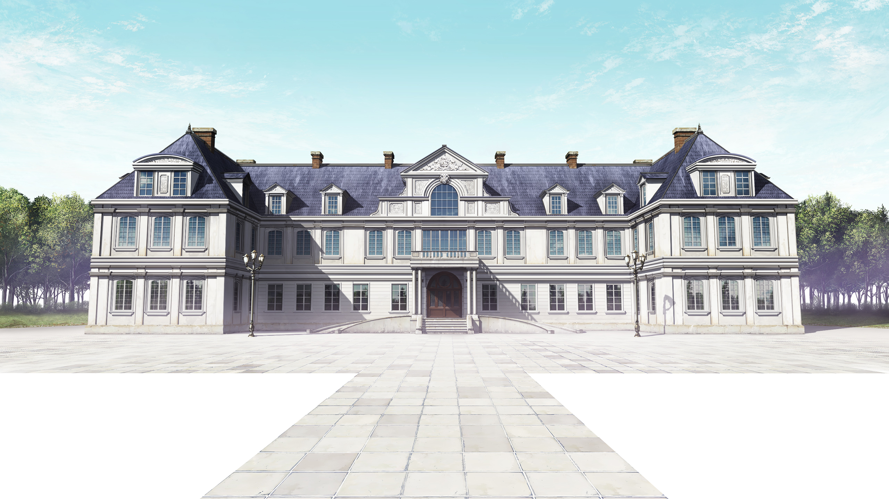
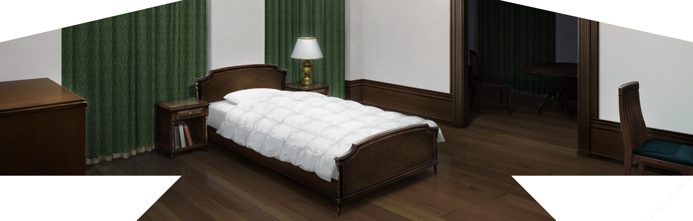
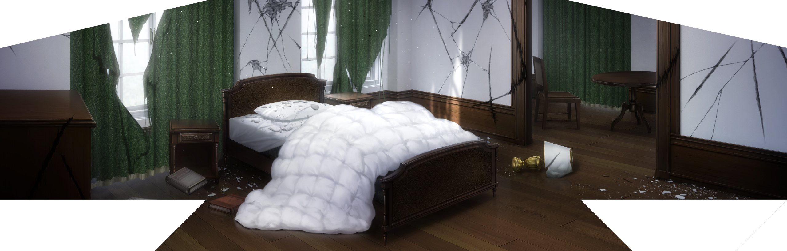

<!--

  

  

-->

<h2 align="center"> 🔎Knowledge </h2>

  
 <!-- TEXT WILL BE HERE (TOO LAZY) -->

     <a href="https://skillicons.dev">
          <!-- Will update it time to time -->
    </a>

 
 
 

<h2 align="center"> 📊 Github Stats </h2>

   
  

<h2 align="center"> 📫 Contact </h2>

<!--

-->
 

  

